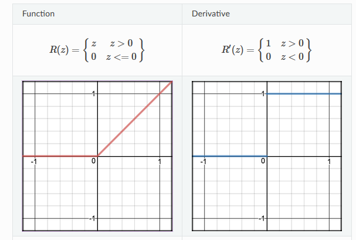

# CS 231n Lecture Note

## Algorithms

### Nearest Neighbor Classifier

### SVM

> -  Naive Implementation
>
>   - https://mlxai.github.io/2017/01/06/vectorized-implementation-of-svm-loss-and-gradient-update.html
>
> - Hinge Loss Function is not strictly differentiable
>
>   - for $l_i=max(0, x_iw_j - x_iw_{y_i}+\Delta)$, at the $x=0$, there is no read gradient.
>
>     - For example, just like `ReLU`, below at the turning point x=0, the gradient could be any thing between 0 and 1. Thus The hinge loss is not differentiable.
>
>         
>
> 

