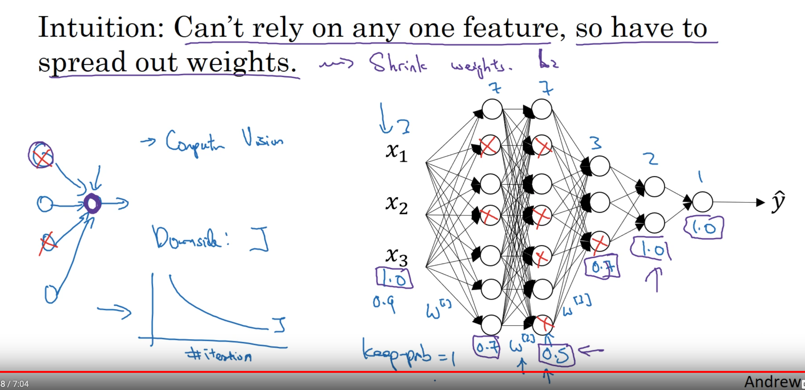
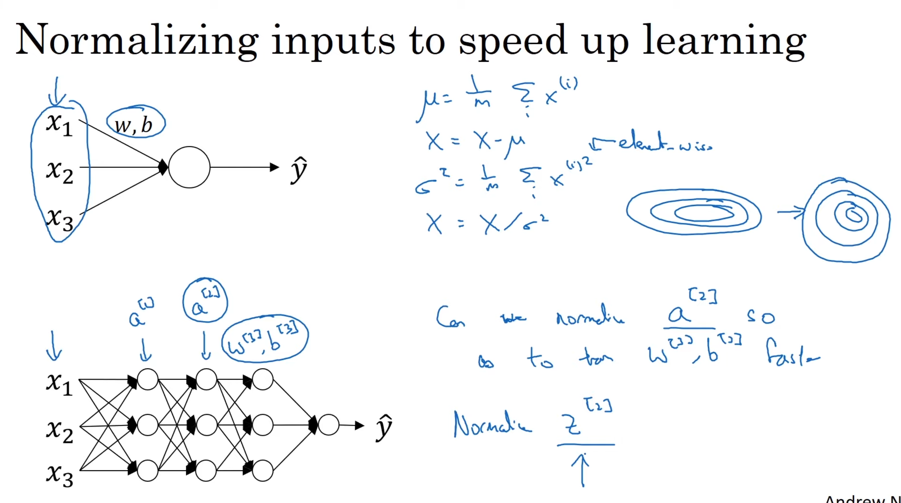
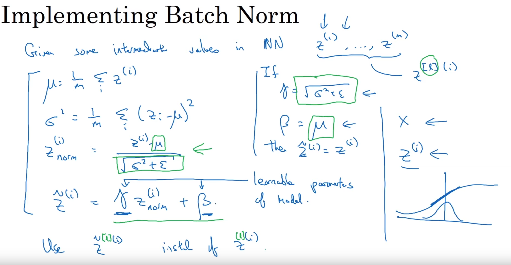
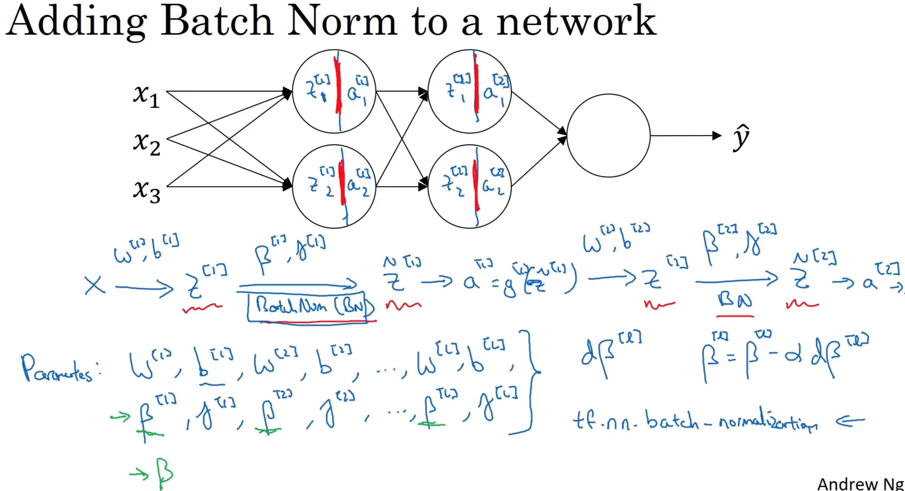
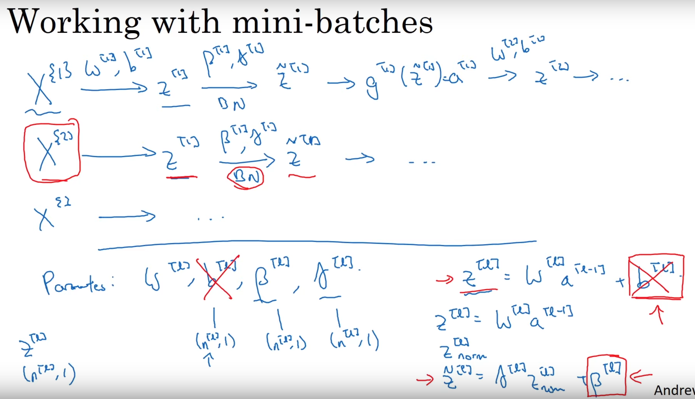
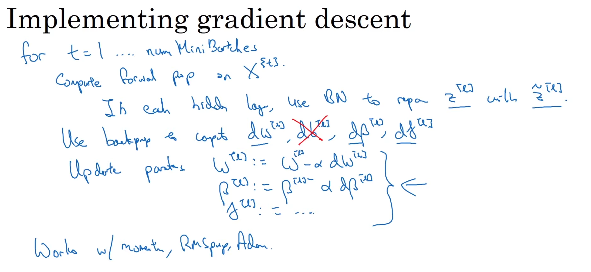
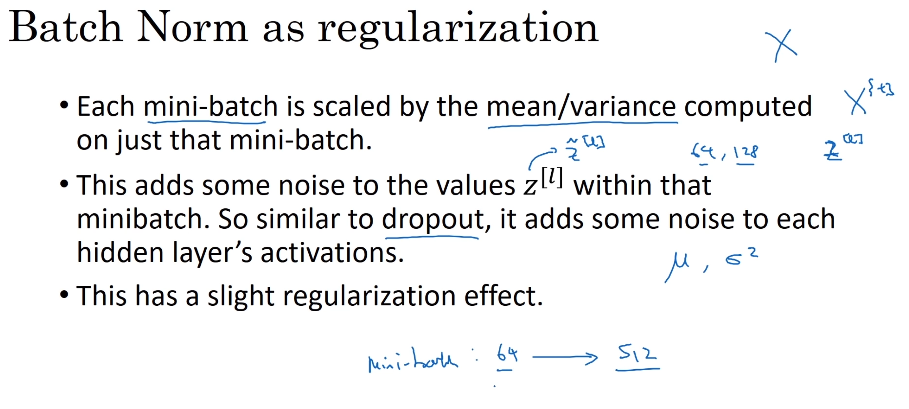
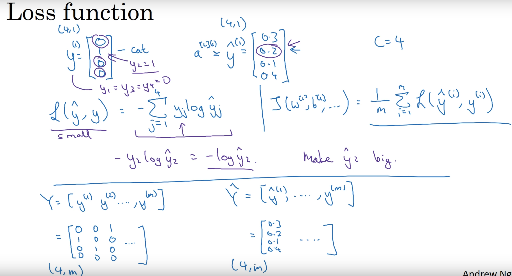

# Deep Learning Notebook

## Machine Learning

### Mathematics

#### Convexity

##### Smoothness

>  a smooth function is **continuous and differentiable everywhere**.
>
> - Absolute function is continuous but not differentiable at $x=0$.

##### Stableness

> a stationary process is unconditional joint probability distribution (parameters) does not change when shifted in time.

##### Harmonic Function

> it is a twice continuously differentiable function $f:U\rightarrow \R$, where $U$ is an open subset of $\R$, that satisfy Laplace's equation everywhere on U:
>
> $$
> \sum_{i=1}^{d}{{\partial^2f}\over{\partial x_i^2}}=0
> $$
> that is usually writes as
> $$
> \nabla^2f=0	\\
> \text{or}	\\
> \Delta f=0
> $$

#####  Local Optima 

>- Left: local optima;	Right: Saddle point (your learning algorithm most likely to be in when the dimension of your data is high).
>  - Your intuition of local dimension doesn't transfer to high dimensional space in fact.
>  - 
>  - 

#### Orthogonaliztion

#### Gradient Relavent

##### Exploding / Vanishing Gradients

> - How it works?
> - Another hyper-parameter to tune: **$n^{[l-1]}$**

##### Two-sided gradient's advantage

> - more accurate than single-sided version
> - It could give you an approximation of relationship between **two-sided gradient and the $\epsilon$** (see the bottom of below picture)
> - 

##### Gradient Checking

> - 
> - 

##### Exponentially Weighted Averages

> - Depend on $\beta$ you chose, the range of data is considered (Here $\theta$ is the current day's temperature)
>
> - 
>
> - Math:
>
>   
>
> - Implementation:
>
>   

###### Biased Correction

> - when you are warming up, especially in the initial period, biased correction could help you approach the purple line to green line to have a better approximation.
>
>   

### Models

#### Discriminant & Generative

> + Discriminant:
>
>   \+ don’t have to learn parameters which aren’t used (e.g. covariance)
>
>   \+ easy to learn 
>
>   \- no confidence measure
>
>   \- have to retrain if dimension of feature vectors changed
>
> - Generative:
>
>   +have confidence measure
>
>   \+ can use ‘reject option’
>
>   \+ easy to add independent measurements
>
>   
>
>   \- expensive to train

####  Hints

> 
>
> - it improves feature selection.
> - Discard the hint units when doing classification.

#### Drop out

##### Theory

> - As one of Regularion method, don't use it unless you want to decrease overfitting.
> - 

#### Batch Normalization

##### Theory

> - Implement it before `Activation layer` is more oftern. Not only use Normalization to the `Input layer`.
>   - 
>   - 
>   - 
>   - Notice that you may eliminate weiught of bias $b$, instead using $\beta$ to control the normalized $z$. 
>   - 
>   - 

##### Wht it works

> - Normalizing the feature to speed up training.
> - Reduce the amount that the distribution that hidden unit values shifts (when input changing). In other words, it reduce the coupling between the earlier layer's parameters and the later layer's.
> - 

#### SoftMax

##### Loss Function

> - 


#### Debug

> 1. Turn off Drop-out, then check the loss function to be monotonically decreasing learned.
>    $$
>    J(W,B)={1\over{m}}\sum\limits_{i=1}^m \mathcal{L}(\hat{y^i},y^i)+{{\lambda}\over{2m}}\sum\limits_{l=i}^{L}\|W^{[l]}\|^2_F \\ \|W^{[l]}\|^2_F=\sum\limits_{i=1}^{n^{[l-1]}}\sum\limits_{j=1}^{n^{[l]}}{(W_{i,j}^{[l]})}^2 \\ w:(n^{[l-1]}, n^{[l]})\text{ hidden units of layer $l-1$ and $l$}
>    $$
>
> 2. Turn on Drop-out.

#### Tuning Strategies

##### Adam Optimizer:

> - Priority: Red -> Yellow -> Blue
> - 

##### Hyper-parameter Searching

> - Fixed values limit the result cause you don't know which parameter plays an important role.
>   - 
> - Then decrease your searching area to find more accurate pairs.
>   - 

##### Hyper-parameter Coordinated Transformation

> - What if Random Uniform doesn't work? (i.g. you wanna search between $.0001$ to $1$)
>   - Logarithmic Operation
>   - 
> - What if we want to find the $\beta$ ?
>   - As you can see, due to ${1}\over{1-\beta}$, when $\beta$ changes from $.999$ to $.9995$, the impact is really huge!
>   - 

### Data Engineering

#### Data Augmentation

##### CV

> - Flipping 翻转
> - Rotation 旋转
> - Rescaling 缩放
> - Cropping 剪裁
> - Shifting 平移
> - Brightness/Contrast/Colorfulness 亮度/饱和度/对比度
> - Gaussian Noise

##### NLP

> - Translate Back
>   - Translating current language samples to another language then translate it back again
> - Text Augmentation
>   - Synonyms Replace
>   - Randomly Inset
>   - Randomly Swap
>   - Randomly Delete

### Feature Engineering

### Model Selection

#### Leave-one-out Cross validation VS K-Fold Validation

https://stats.stackexchange.com/questions/61783/bias-and-variance-in-leave-one-out-vs-k-fold-cross-validation

> - In theory
>   - **If cross-validation were averaging independent estimates**: then leave-one-out CV one should see relatively lower variance between  models since we are only shifting one data point across folds and  therefore the training sets between folds overlap substantially.
>   - **This is not true when training sets are highly correlated**: Correlation may increase with K and this increase is responsible for the overall increase of variance in the second scenario. Intuitively, in that situation, leave-one-out CV may be blind to instabilities that exist, but may not  be triggered by changing a single point in the training data, which  makes it highly variable to the realization of the training set. 
> - In practice
>   - If the sample size is pretty small ($\leq 40$), then K should be $\geq 10$ which may greatly improve the variance and bias.
>   - If the sample size is large ($\approx 200$), there is no need for k-fold cross validation actually.


## Transfer Learning

### Implementations

#### Transfer Learning with pretrained CNN from Tensorflow Core

https://www.tensorflow.org/tutorials/images/transfer_learning

Targets: 1. Feature Extraction, 2. Fine-Tune

> 1. Data Preprocessing
>
>    1. download dataset
>    2. Format the Data
>       1. use `tf.image` module to format the data
>
> 2. Create the base model from the pretrained convnets
>
>    1. Take **MobileNet V2** as example
>
>       - The very last classification layer on top is not practical. Instead, you should depend on the vert last layer before the flatten operation, which is called "bottleneck layer" with much generality  as compare to the final layer.
>
>         ```python
>         base_model = tf.keras.applications.MobileNetV2(input_shape=IMG_SHAPE,
>                                                        include_top=False,
>                                                        weights='imagenet')
>         ```
>
>  3. Feature Extraction
>
>      1. Freezing the convolutional base by `base_model.trainable = False`
>
>      2. Add a classification head
>
>      3. Compile the model
>
>      4. Train the model
>
>      5. Read the learning curves (Training/Validating Curves)
>
>         
>
>  4. Fine-tuning
>
>      	1. Unfreeze the top layers of the model
>           	2. Compile the model
>                	3. Train the model
>          - If the validation loss is much higher than the training loss, be aware of the overfitting

## Semi-supervised Learning

### Ladder Network

https://zhuanlan.zhihu.com/p/34516078

https://rinuboney.github.io/2016/01/19/ladder-network.html

## Bayesian Neural Network

## Recurrent Neural Network

### Basic RNN


### LSTM


#### Bidirectional LSTMs

> - duplicating the first recurrent layer in the network so that there are now 2 layers side-by-side, then providing the input sequence as-is as input to the first layer and providing a reversed copy of the input sequence
>   - `The idea is to split the state neurons of a regular RNN in a part that  is responsible for the positive time direction (forward states) and a  part for the negative time direction (backward states)`
> - The use of providing the sequence bi-directionally was initially  justified in the domain of speech recognition because there is evidence  that the context of the whole utterance is used to interpret what is  being said rather than a linear interpretation.
>   - `… relying on knowledge of the future seems at first sight to violate  causality. How can we base our understanding of what we’ve heard on  something that hasn’t been said yet? However, human listeners do exactly that. Sounds, words, and even whole sentences that at first mean  nothing are found to make sense in the light of future context. What we  must remember is the distinction between tasks that are truly online –  requiring an output after every input – and those where outputs are only needed at the end of some input segment.`

### Attention

---

## Applications

### Handwriting System

#### Bézier **Curve**

> https://medium.com/@Acegikmo/the-ever-so-lovely-b%C3%A9zier-curve-eb27514da3bf


