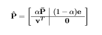
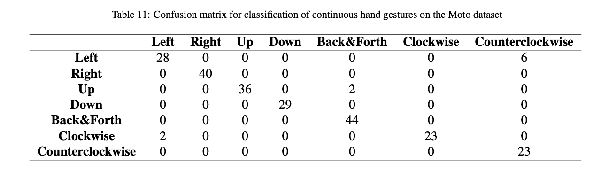
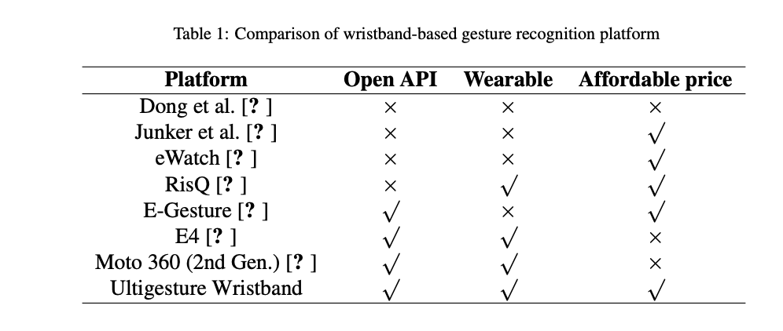
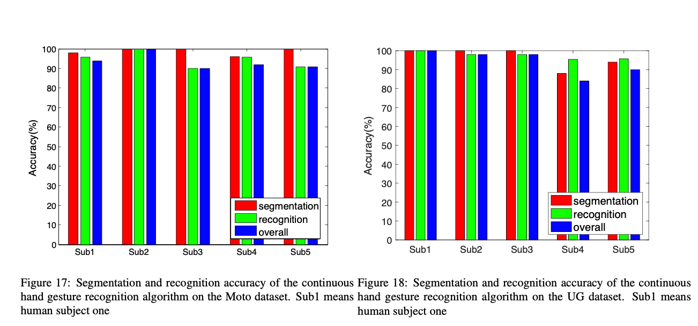
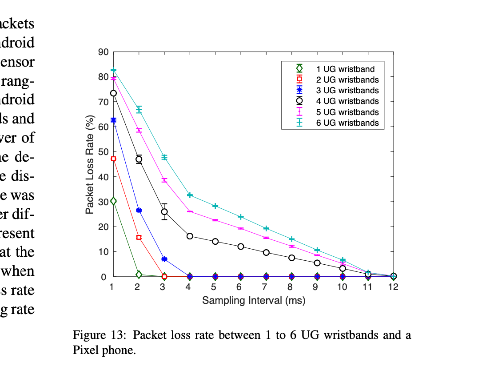

# LaTeX-Guide

## Math

>  **should import amsmath if you use want any serious math display**!
>
> ```latex
> \usepackage{amsmath, amsfonts, amssymb}
> ```

### Alignment

> https://www.overleaf.com/learn/latex/aligning_equations_with_amsmath
>
> ```latex
> \begin{aligned} 
> 2x - 5y &=  8 \\ 
> 3x + 9y &=  -12
> \end{aligned}
> ```

### Open Math

> ```latex
> % open math block, doesn't like begin{equation}, this doesn't number the equation
> \[
> \mathbf{\hat{P}} =
> \begin{bmatrix}
>     \begin{array}{c|c}
>          \alpha \mathbf{\bar{P}} & (1-\alpha)\mathbf{e} \\
>          \hline
>          \mathbf{v}^T & \mathbf{0}
>     \end{array}
> \end{bmatrix}
> \]
> ```
>
> 

## Grammar

### Font Style

> **typewriter font**
>
> ```
> \texttt{balabala}
> ```
>
> 

### Reference

> **Design the style**
>
> ```latex
> \usepackage{xcolor}
> \hypersetup{
>   colorlinks   = true, %Colours links instead of ugly boxes
>   urlcolor     = blue, %Colour for external hyperlinks
>   linkcolor    = blue, %Colour of internal links
>   citecolor   = red %Colour of citations
> }
> ```

### Table

> ```latex
> \begin{table}
> \caption{Confusion matrix for classification of continuous hand gestures on the Moto dataset
> }
> \centering
> \begin{tabular}{cccccccc}
> 
> \hline
>    & \textbf{Left} & \textbf{Right}  & \textbf{Up} & \textbf{Down} & \textbf{Back\&Forth} & \textbf{Clockwise} & \textbf{Counterclockwise} \\
>   \hline
>   \textbf{Left}  & 28 & 0 & 0  & 0 & 0 & 0 & 6\\
> 
>   \textbf{Right}  & 0 & 40 & 0  & 0 & 0 & 0 & 0\\
> 
>   \textbf{Up}  & 0 & 0 & 36  & 0 & 2 & 0 & 0\\
> 
>   \textbf{Down} & 0 & 0 & 0  & 29 & 0 & 0 & 0\\
> 
>   \textbf{Back\&Forth}  & 0 & 0 & 0  & 0 & 44 & 0 & 0\\
> 
>   \textbf{Clockwise}  & 2 & 0 & 0  & 0 & 0 & 23 & 0\\
> 
>   \textbf{Counterclockwise}  & 0 & 0 & 0  & 0 & 0 & 0 & 23\\
>   \hline
>   
> \end{tabular}
> \label{table:Recog Accuracy in continuous gesture}
> \end{table}
> ```
>
> 

> ```latex
> \begin{table}
> \caption{Comparison of wristband-based gesture recognition platform}
> \centering
> \begin{tabular}{cccc}
> \hline
>   \textbf{Platform} & \textbf{Open API}  & \textbf{Wearable} &  \textbf{Affordable price} \\
>   \hline
>   Dong et al.~\cite{dong2009device} & $\times$ & $\times$ & $\times$ \\
> 
>   Junker et al.~\cite{junker2008gesture} & $\times$ & $\times$ & $\surd$ \\
> 
>   eWatch~\cite{maurer2006ewatch} & $\times$ & $\times$ & $\surd$ \\
> 
>   RisQ~\cite{parate2014risq} & $\times$ & $\surd$ & $\surd$ \\
> 
>   E-Gesture~\cite{park2011gesture} & $\surd$ & $\times$ & $\surd$ \\
> 
>   E4~\cite{E4} & $\surd$ & $\surd$ & $\times$ \\
> 
>   Moto 360 (2nd Gen.)~\cite{moto360}  & $\surd$ & $\surd$ & $\times$  \\
> 
>   Ultigesture Wristband  & $\surd$  & $\surd$ & $\surd$ \\
>   \hline
> \end{tabular}
> \label{table:platform_comparison}
> \end{table}
> ```
>
> 

### Figure

> ```latex
> \begin{figure}
>     \centering
>     \begin{minipage}{0.48\textwidth}
>         \includegraphics[width=0.95\linewidth]{figures/ContinuousSegmentAccuracy}
>         \caption{Segmentation and recognition accuracy of the continuous hand gesture recognition algorithm on the Moto dataset. Sub1 means human subject one}
>         \label{fig:ContinuousSegmentAccuracy}
>     \end{minipage}
>     \begin{minipage}{0.48\textwidth}
>         \includegraphics[width=0.9\linewidth]{figures/ContinuousSegmentAccuracy_UG}
>         \caption{Segmentation and recognition accuracy of the continuous hand gesture recognition algorithm on the UG dataset. Sub1 means human subject one}
>         \label{fig:ContinuousSegmentAccuracy_UG}
>     \end{minipage}
> \end{figure}
> ```
>
> 


> ```latex
> \begin{wrapfigure}{R}{3in}
> \centering
> \includegraphics[width=2.97in]{figures/SegmentAccuracy_Window}
> \caption{Precision, recall and accuracy under different window size}
> \label{fig:window}
> \end{wrapfigure}
> ```
>
> 

> ```latex
> \begin{figure}
> \centering
>   \includegraphics[width=0.9\columnwidth]{figures/Mode_Transition.pdf}
>   \caption{Mode Transition}
>    \label{fig:Mode_Transition}
> \end{figure}
> ```
>
> 

## OneNote

> Holding **`control - +`** together then you could type in math model