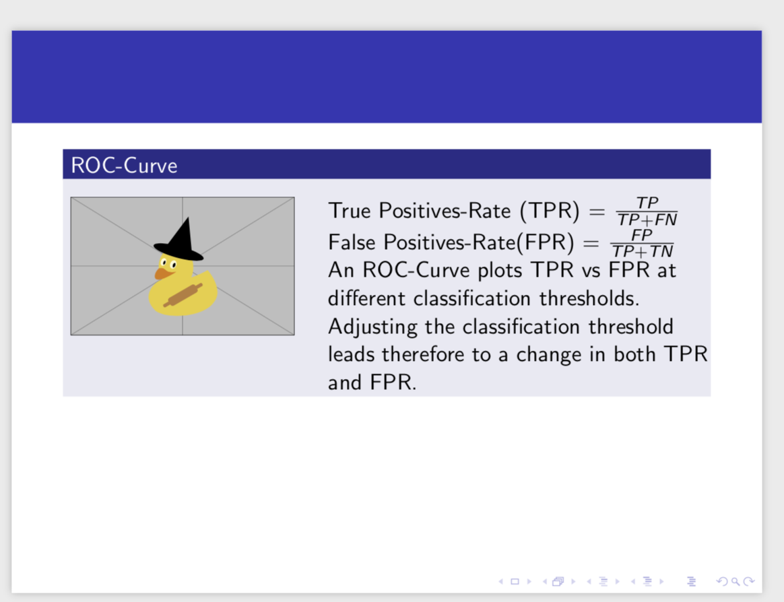
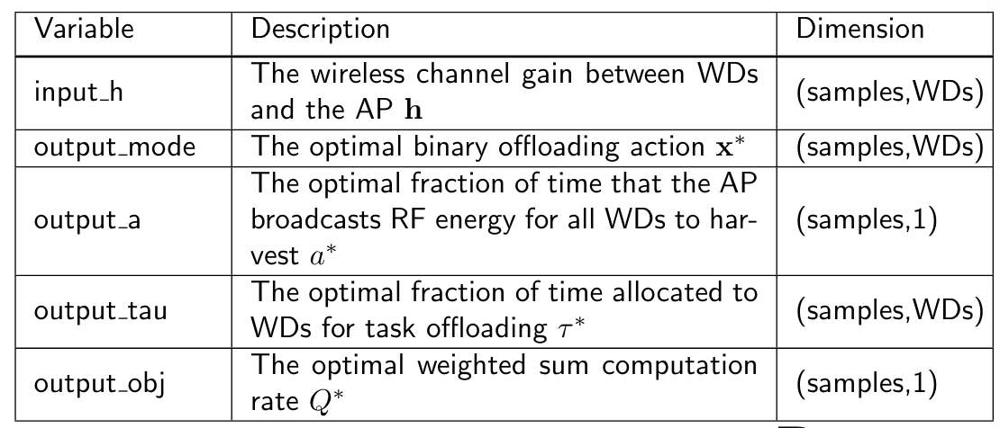
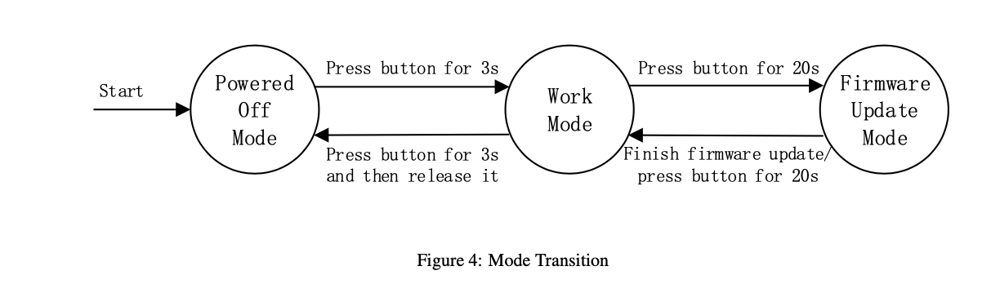

# LaTeX-Guide

## My Beamer Style for <u>*preamble.tex*</u>

> ```latex
> %
> % See the README.md for usage instructions. This style really only has one
> % option: When called with the "altlogo" option, it will use the "Purdue
> % University" logo instead of the "Purdue Engineering" logo.
> % we want serif math fonts, they look better
> 
> 
> 
> % this package is for text alignment
> \usepackage{ragged2e}
> 
> % load required packages. I prefer IEEEtran for equations, but that's a
> % personal preference.
> \usepackage{IEEEtrantools}
> \usepackage{csquotes}
> % the citation style follows the requirement of 2020 NIPS
> \usepackage[natbib=true, bibstyle=authoryear-icomp, citestyle=authoryear-icomp, maxbibnames=99]{biblatex}
> % \usepackage[style=verbose-ibid, backend=bibtex]{biblatex}
> \bibliography{0_citations.bib}
> \renewcommand{\footnotesize}{\tiny}
> 
> %% self made citation
> %%%%%%%%%%%%%%%%%%%%%%%%%%%%%%%%%%%%%%%%%%%%
> \DeclareCiteCommand{\printcite}
>   {\boolfalse{citetracker}%
>   \boolfalse{pagetracker}%
>   \usebibmacro{prenote}}
>   {\ifciteindex
>      {\indexnames{labelname}%
>       \indexfield{indextitle}}
>      {}%
>   \printtext[bibhyperref]{%
>       \printnames{labelname}%
>       \setunit{\labelnamepunct}%
>       \printfield[citetitle]{labeltitle}%
>       \newunit
>       \printfield{year}%
>      }%
>   }
>   {\multicitedelim}
>   {\usebibmacro{postnote}}
> %%%%%%%%%%%%%%%%%%%%%%%%%%%%%%%%%%%%%%%%%%%%
> 
> \usepackage{pgf}  % PGF/TikZ is needed for nice plots
> 
> \usepackage[cmex10]{mathtools} % for math equations
> \usepackage{amssymb}
> \usepackage{bm}
> \usepackage{wrapfig}
> 
> 
> % theorems - can use \begin{IEEEproof} as alternative to \begin{proof}
> \usepackage{amsthm}
> \renewcommand{\qedsymbol}{$\blacksquare$} % want a black square for proofs
> 
> % useful to set this when using Inkscape SVG figures
> \graphicspath{{./graphics/}}
> 
> % tell beamer to use the purdue-gold theme
> % \usetheme[altlogo]{purduegold}
> \usetheme{purduegold}
> 
> % Justifying paragraphs to be same wide Allow optional arguments after frame.
> \apptocmd{\frame}{}{\justifying}{} 
> % justifying itemize
> \let\olditem\item
> \renewcommand\item{\olditem\justifying}
> \setlength{\parindent}{0ex} 
> 
> % redefine style for \emph{}
> \setbeamercolor{emph}{fg=red}
> \renewcommand<>{\emph}[1]{%
>   {\usebeamercolor[fg]{emph}\only#2{\itshape}#1}%
> }
> % \makeatletter
> % \DeclareRobustCommand{\em}{%
> %   \@nomath\em \if b\expandafter\@car\f@series\@nil
> %   \normalfont \else \bfseries \fi}
> % \makeatother
> 
> \usepackage{hyperref}
> \usepackage[all]{hypcap}        % needed to help hyperlinks direct correctly;
> \hypersetup{
>     colorlinks=true,
>     linkcolor=blue,
>     filecolor=magenta,      
>     urlcolor=cyan,
> }
> 
> % self made command for better jumping display
> %%%%%%%%%%%%%%%%%%%%%%%%%%%%%%%%%%%%%%%%%%%%%%%%%%%%%%%%%%%%%%%%%%%%%%%%%%%%%
> % for those referring label you don't need some "text" for it, you may use \label directly instead
> % \label
> 
> \makeatletter
> \newcommand{\pagetarget}[2]% #1=label (both hypertarget and label), #2=text
> {\hypertarget{#1}{#2}\protected@write\@auxout{}{%
>    \string\newlabel{#1}{{#2}{\thepage}{page.\thepage}{#1}{}}}}
> \makeatother
> 
> % \hyperlink{#1}{button} will link to #2.
> % \pagelink{#1}{button} will link to the page anchor.
> % \ref{#1} will return #2 and link to #2.
> % \pageref will return the page and link to #2.
> % \getrefbykeydefault{#1}{name}{Doc-Start} returns the page anchor.
> % \textlink returns the #2 and link to page anchor
> % \eqref returns the equation index and link to page anchor
> 
> %
> \newcommand{\pagelink}[2]% #1=label, #2=text
> {\hyperlink{\getrefbykeydefault{#1}{name}{Doc-Start}}{#2}}
> 
> % 
> \newcommand{\textlink}[1]% #1=label
> {\hyperlink{\getrefbykeydefault{#1}{name}{Doc-Start}}{\getrefnumber{#1}}}
> 
> %
> \renewcommand{\eqref}[1]% #1=label
> {\hyperlink{\getrefbykeydefault{#1}{name}{Doc-Start}}{Eq.\getrefnumber{#1}}}
> 
> % Bell for l
> \newcommand*\Bell{\ensuremath{\boldsymbol\ell}}
> 
> % include subsection index along with equation's index
> \numberwithin{equation}{subsection}
> ```
>
> 

## NIPS Citation

> - Create a file named "preamble.tex" which contains style design.
>
> - In that file, add
>
>   ```latex
>   % load required packages. I prefer IEEEtran for equations, but that's a
>   % personal preference.
>   \usepackage{IEEEtrantools}
>   \usepackage{csquotes}
>   
>   % the citation style follows the requirement of 2020 NIPS
>   %%%%%%%%%%%%%%%%%%%%%%%%%%%%%%%%%%%%%%%%%%%%%%%%%%%%%%%%%%%%
>   \usepackage[natbib=true, bibstyle=authoryear-icomp, citestyle=authoryear-icomp, maxbibnames=99]{biblatex}
>   % \usepackage[style=verbose-ibid, backend=bibtex]{biblatex}
>   \bibliography{0_citations.bib}
>   %%%%%%%%%%%%%%%%%%%%%%%%%%%%%%%%%%%%%%%%%%%%%%%%%%%%%%%%%%%%
>   \renewcommand{\footnotesize}{\tiny}
>   ```
>
> - While writing, use this to print the Bibliography
>
>   ```latex
>   \printbibliography
>   ```

> ### Refresh Overleaf compiliation
>
> - If re-compile doesn't work, that must be the files need totally rebuilt from scratch. Have to `clear caches`!
> - 

## Math

>  **should import amsmath if you use want any serious math display**!
>
>  ```latex
>  \usepackage{amsmath, amsfonts, amssymb}
>  ```
>
>  - `\bm{}`: use for bold style of Math.

### Equations

#### Sub-equations and Multi-alignment

> - Could use `&` as much as you want. 
> - `{Subequations}` would auto mark them all, notice, you may want to index each sub equations for referencing later.
>
> ```latex
> \begin{subequations}
>          \begin{IEEEeqnarray}{rCl}
>             (P1): \-\hspace{4}
>             Q^*(\textbf{h}) &= \arg \max_{\textbf{x}, \bm{\tau}, a} & Q(\textbf{h}, \textbf{x}, \bm{\tau}, a) \label{eq:p1_Q-system_a} \\
>             & \text{subject to} & \sum^N_{i=1} \tau_i + a \leq 1, \label{eq:p1_Q-system_b} \\
>             & & a \geq 0, \tau_i \geq 0, \forall i \in \mathcal{N}, \label{eq:p1_Q-system_c} \\
>             & & x_i \in \{0,1\}. \label{eq:p1_Q-system_d}
>         \end{IEEEeqnarray}
>     \end{subequations}
> ```
>
> 
>
> 

#### Equation Index Manipulation

> - Use the last equation's index. (The LaTeX would automatically increase the index for new equation)
>
> ```latex
> \addtocounter{equation}{-1}
> ```

### Open Math

> ```latex
> % open math block, doesn't like begin{equation}, this doesn't number the equation
> \[
> \renewcommand\arraystretch{1.3}
> \mathbf{\hat{P}} =
> \begin{bmatrix}
>     \begin{array}{c|c}
>          \alpha \mathbf{\bar{P}} & (1-\alpha)\mathbf{e} \\
>          \hline
>          \mathbf{v}^T & \mathbf{0}
>     \end{array}
> \end{bmatrix}
> \]
> ```
>
> 

## Grammar

### Paragraph

#### *Better Jumping Logic

> - Normally, the `\ref` or `\hyperlink` or any jumping method would always put the jumping label to the top of view that causing seriously display issue.
>
> ```latex
> \documentclass{book}
> \usepackage{lipsum}
> \usepackage{hyperref}
> 
> % self made command for better jumping display
> %%%%%%%%%%%%%%%%%%%%%%%%%%%%%%%%%%%%%%%%%%%%%%%%%%%%%%%%%%%%%%%%%%%%%%%%%%%%%
> % for those referring label you don't need some "text" for it, you may use \label directly instead
> % \label
> 
> \makeatletter
> \newcommand{\pagetarget}[2]% #1=label (both hypertarget and label), #2=text
> {\hypertarget{#1}{#2}\protected@write\@auxout{}{%
>    \string\newlabel{#1}{{#2}{\thepage}{page.\thepage}{#1}{}}}}
> \makeatother
> 
> % \hyperlink{#1}{button} will link to #2.
> % \pagelink{#1}{button} will link to the page anchor.
> % \ref{#1} will return #2 and link to #2.
> % \pageref will return the page and link to #2.
> % \getrefbykeydefault{#1}{name}{Doc-Start} returns the page anchor.
> % \textlink returns the #2 and link to page anchor
> % \eqref returns the equation index and link to page anchor
> 
> %
> \newcommand{\pagelink}[2]% #1=label, #2=text
> {\hyperlink{\getrefbykeydefault{#1}{name}{Doc-Start}}{#2}}
> 
> % 
> \newcommand{\textlink}[1]% #1=label
> {\hyperlink{\getrefbykeydefault{#1}{name}{Doc-Start}}{\getrefnumber{#1}}}
> 
> %
> \renewcommand{\eqref}[1]% #1=label
> {\hyperlink{\getrefbykeydefault{#1}{name}{Doc-Start}}{Eq.\getrefnumber{#1}}}
> 
> %%%%%%%%%%%%%%%%%%%%%%%%%%%%%%%%%%%%%%%%%%%%%%%%%%%%%%%%%%%%%%%%%%%%%%%%%%%%%
> 
> \begin{document}
> 
> Following link will go to top of \hyperlink{page.3}{page 3}.
> 
> I want \hyperlink{mytarget1}{this link} to also go to top of page 3, because ``mytarget1'' is located on this page.
> 
> And \hyperlink{mytarget2}{this one} to top of page 4, because ``mytarget2'' is located on this page.
> 
> \lipsum[1-15]
> 
> \pagetarget{mytarget1}{mytarget1} is on this page
> 
> \lipsum[5]
> 
> \pagetarget{mytarget2}{mytarget2} is on this page
> 
> \end{document}
> ```
>
> 

#### Columns

> - Sometimes, especially for `Beamer`, you may want **columns** instead of **wrap figure**.
>
> ```latex
> \documentclass{beamer}
> \usetheme{Rochester}
> \begin{document}
> 
> \begin{frame}[t]
> \begin{block}{ROC-Curve}
> \begin{columns}[T]
> \begin{column}{0.33\linewidth}
> ~\includegraphics[height=0.3\textheight,keepaspectratio]{example-image-duck}
> \end{column}
> \begin{column}{0.6\linewidth}
>     True Positives-Rate (TPR) = $\frac{TP}{TP + FN}$
> 
>     False Positives-Rate(FPR) = $\frac{FP}{TP + TN}$
> 
>     An ROC-Curve plots TPR vs FPR at different classification thresholds.
>     Adjusting the classification threshold leads therefore to a change in
>     both TPR and FPR. 
> \end{column}
> \end{columns}
> \end{block}
> 
> \end{frame}
> \end{document}
> ```
>
> 

#### Reference Style

> - Change the clickable reference's style
>
> ```latex
> % dependency in preamble
> \usepackage{hyperref}
> \hypersetup{
>     colorlinks=true,
>     linkcolor=blue,
>     filecolor=magenta,      
>     urlcolor=cyan,
> }
> % By default, URLs are printed using mono-spaced fonts. 
> \urlstyle{same}
> 
> %%%%%%%%%%%%%%%%%%%%%%%%%%%%%%%%%%%
> % in document
> \hyperlink{referecing label}{conetent}
> ```


### Font Style

> **typewriter font**
>
> ```
> \texttt{balabala}
> ```
>
> 

### Bibliography

#### Color the Citation

> ```latex
>\usepackage{xcolor}
> \hypersetup{
> colorlinks   = true, %Colours links instead of ugly boxes
> urlcolor     = blue, %Colour for external hyperlinks
>   linkcolor    = blue, %Colour of internal links
>   citecolor   = red %Colour of citations
>   }
>   ```

### Table

> ```latex
> \begin{table}
> \caption{Confusion matrix for classification of continuous hand gestures on the Moto dataset
> }
> \centering
> \begin{tabular}{cccccccc}
> 
> \hline
>    & \textbf{Left} & \textbf{Right}  & \textbf{Up} & \textbf{Down} & \textbf{Back\&Forth} & \textbf{Clockwise} & \textbf{Counterclockwise} \\
>   \hline
>   \textbf{Left}  & 28 & 0 & 0  & 0 & 0 & 0 & 6\\
> 
>   \textbf{Right}  & 0 & 40 & 0  & 0 & 0 & 0 & 0\\
> 
>   \textbf{Up}  & 0 & 0 & 36  & 0 & 2 & 0 & 0\\
> 
>   \textbf{Down} & 0 & 0 & 0  & 29 & 0 & 0 & 0\\
> 
>   \textbf{Back\&Forth}  & 0 & 0 & 0  & 0 & 44 & 0 & 0\\
> 
>   \textbf{Clockwise}  & 2 & 0 & 0  & 0 & 0 & 23 & 0\\
> 
>   \textbf{Counterclockwise}  & 0 & 0 & 0  & 0 & 0 & 0 & 23\\
>   \hline
>   
> \end{tabular}
> \label{table:Recog Accuracy in continuous gesture}
> \end{table}
> ```
>
> 

> ```latex
> \begin{table}
> \caption{Comparison of wristband-based gesture recognition platform}
> \centering
> \begin{tabular}{cccc}
> \hline
>   \textbf{Platform} & \textbf{Open API}  & \textbf{Wearable} &  \textbf{Affordable price} \\
>   \hline
>   Dong et al.~\cite{dong2009device} & $\times$ & $\times$ & $\times$ \\
> 
>   Junker et al.~\cite{junker2008gesture} & $\times$ & $\times$ & $\surd$ \\
> 
>   eWatch~\cite{maurer2006ewatch} & $\times$ & $\times$ & $\surd$ \\
> 
>   RisQ~\cite{parate2014risq} & $\times$ & $\surd$ & $\surd$ \\
> 
>   E-Gesture~\cite{park2011gesture} & $\surd$ & $\times$ & $\surd$ \\
> 
>   E4~\cite{E4} & $\surd$ & $\surd$ & $\times$ \\
> 
>   Moto 360 (2nd Gen.)~\cite{moto360}  & $\surd$ & $\surd$ & $\times$  \\
> 
>   Ultigesture Wristband  & $\surd$  & $\surd$ & $\surd$ \\
>   \hline
> \end{tabular}
> \label{table:platform_comparison}
> \end{table}
> ```
>
> 

> **Bold line**
>
> ```latex
> % you gonna use those two packages
> \usepackage{boldline}
> \usepackage{array}
> 
> % content
> \begin{center}\small
>          \begin{tabular}[c]{| m{6em} | m{17em} | m{6em} |} 
>          \hline
>         Variable & Description & Dimension \\ [0.5ex] 
>          \hlineB{2}
>          input\_h & The wireless channel gain between WDs and the AP $\mathbf{h}$ & (#samples,#WDs) \\ 
>          \hline
>         output\_mode & The optimal binary offloading action $\mathbf{x}^*$ & (#samples,#WDs) \\
>          \hline
>          output\_a & The optimal fraction of time that the AP broadcasts RF energy for all WDs to harvest $a^*$ & (#samples,1) \\
>          \hline
>          output\_tau & The optimal fraction of time allocated to WDs for task offloading $\mathbf{\tau}^*$ & (#samples,#WDs) \\
>          \hline
>         output\_obj & The optimal weighted sum computation rate $Q^*$ & (#samples,1) \\ [1ex] 
>         \hline
>         \end{tabular}
>     \end{center}
> ```
>
> 

### Figure

> ```latex
> \begin{figure}
>  \centering
>  \begin{minipage}{0.48\textwidth}
>      \includegraphics[width=0.95\linewidth]{figures/ContinuousSegmentAccuracy}
>      \caption{Segmentation and recognition accuracy of the continuous hand gesture recognition algorithm on the Moto dataset. Sub1 means human subject one}
>      \label{fig:ContinuousSegmentAccuracy}
>  \end{minipage}
>  \begin{minipage}{0.48\textwidth}
>      \includegraphics[width=0.9\linewidth]{figures/ContinuousSegmentAccuracy_UG}
>      \caption{Segmentation and recognition accuracy of the continuous hand gesture recognition algorithm on the UG dataset. Sub1 means human subject one}
>      \label{fig:ContinuousSegmentAccuracy_UG}
>  \end{minipage}
> \end{figure}
> ```
>
> 


> ```latex
> \begin{wrapfigure}{R}{3in}
> \centering
> \includegraphics[width=2.97in]{figures/SegmentAccuracy_Window}
> \caption{Precision, recall and accuracy under different window size}
> \label{fig:window}
> \end{wrapfigure}
> ```
>
> 

> ```latex
> \begin{figure}
> \centering
>   \includegraphics[width=0.9\columnwidth]{figures/Mode_Transition.pdf}
>   \caption{Mode Transition}
>    \label{fig:Mode_Transition}
> \end{figure}
> ```
>
> 

> ```latex
> \usepackage{graphicx}
> \usepackage{subcaption}
> \usepackage[export]{adjustbox}
> 
> 
> \begin{figure}[h]
> % 
> \begin{subfigure}[h]{0.5\textwidth}
> \includegraphics[width=0.3\linewidth, height=3.5cm, center]{imgs/1.png} 
> \caption{Directed graph representing}
> \label{fig:subim1}
> \end{subfigure}
> %
> \begin{subfigure}[h]{0.5\textwidth}
> \includegraphics[width=0.8\linewidth, height=3.5cm, center]{imgs/2.png}
> \caption{The Markov Chain matrix}
> \label{fig:subim2}
> \end{subfigure} 
> %%
> \caption{A simple example of a web with $6$ pages}
> \label{fig:img1}
> \end{figure}
> ```
>
> 

## OneNote

> Holding **`control - +`** together then you could type in math model